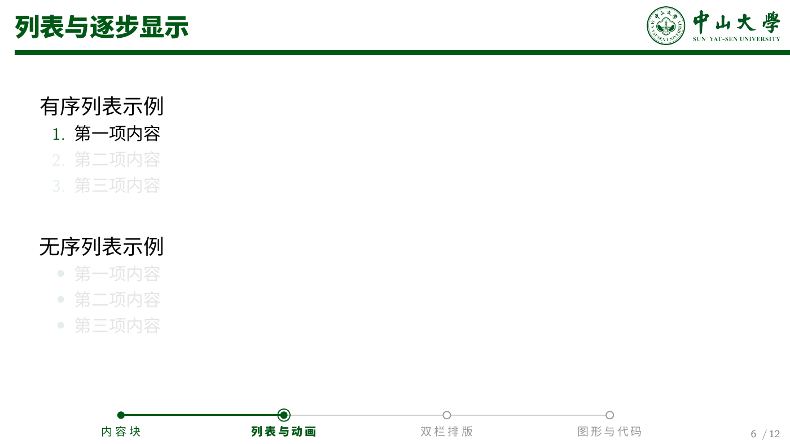

# SYSU-PPT

中山大学PPT模板，更新中

基于 LaTeX Beamer 与 Verona 主题的中山大学演示模板，提供中文和英文示例，
采用 16:9 页面、中大绿色和可点击的页脚章节时间轴。

## 下载与预览

| 版本 | 示例 PDF | LaTeX 源文件 |
| --- | --- | --- |
| 中文版 | [main-zh.pdf](main-zh.pdf) | [main-zh.tex](main-zh.tex) |
| 英文版 | [main.pdf](main.pdf) | [main.tex](main.tex) |

两个示例均包含 17 个 PDF 页面（含逐步显示产生的动画分页）。
模板包含内容块、列表与动画、双栏公式、TikZ 图形、代码及致谢页。



[查看英文版预览](timeline-preview.png)

## 本地编译

使用 XeLaTeX 和 latexmk，已在 TeX Live 2026 环境下验证。
项目自带的 tcolorbox 需要 LaTeX 内核版本不早于 2025-06-01，建议使用 TeX Live 2026。
中文版优先使用 Noto CJK 字体，未安装时自动回退到 TeX Live 自带的 Fandol 字体。

```bash
git clone https://github.com/rudykon/SYSU-PPT.git
cd SYSU-PPT

# 中文版
latexmk -interaction=nonstopmode -halt-on-error main-zh.tex

# 英文版
latexmk -interaction=nonstopmode -halt-on-error main.tex
```

`.latexmkrc` 已配置 XeLaTeX，并从项目内 `.texmf` 加载补充依赖。
运行命令时应位于仓库根目录。PDF 和预览图随仓库提供，编译中间文件不纳入版本管理。

## 修改模板

在 `main-zh.tex` 或 `main.tex` 的导言区修改标题、作者、邮箱、单位和日期，
在正文中替换各个 `frame` 的内容。示例中的作者信息可按实际汇报人替换。

时间轴替换了原来的作者、单位和标题页脚，右侧保留页码。
节点自动生成，支持点击跳转，当前节点用绿色双圈和加粗文字标记。
封面和致谢等 `[plain]` 页面不显示时间轴。

```latex
% 按当前大章节内的小节显示（示例默认设置）
\useoutertheme[subsections]{sysutimeline}

% 或按大章节显示：用这一行替换上一行
\useoutertheme{sysutimeline}
```

标题较长时可给时间轴指定短标题，例如：

```latex
\section[研究方法]{研究方法与技术路线}
\subsection[实验结果]{实验结果与对比分析}
```

详细设置和已知编译提示见 [README-build.md](README-build.md)。

## 主要文件

| 文件 | 用途 |
| --- | --- |
| `main-zh.tex` / `main.tex` | 中文 / 英文入口 |
| `beamerthemeVerona.sty` | 原有中大风格的 Verona 主题 |
| `beamerouterthemesysutimeline.sty` | 页脚章节时间轴 |
| `sysu_logo.png` / `sysu_horizontal.png` | 封面和页眉校徽图片 |
| `.texmf/tex/latex/` | lipsum、multirow、pdfcol、tcolorbox、tikzfill 补充依赖 |

## 致谢

感谢 [sysuexam/SYSU-PPT](https://github.com/sysuexam/SYSU-PPT) 项目及其维护者
分享中山大学 PPT 模板和相关资源。

## 来源说明

Verona 主题文件保留 Ivan Valbusa 的原作者信息和 LPPL 许可声明。
随附的第三方 LaTeX 宏包保留各自的版权与许可声明，详见对应文件头部。
